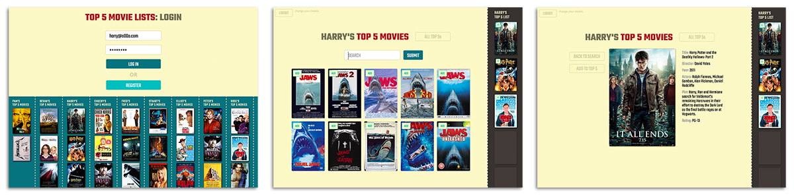

# OMDb — top 5 movie lists

### Description
Search, save, update and display your own favourite movies securely. View other users top5 lists and details in a simple well designed user interface.

### Technologies used
* OMDb [http://www.omdbapi.com/](http://www.omdbapi.com)
* Ruby on Rails
* Postgres
* Javascript, jQuery
* HTML5, CSS, iFrame
* Gems: bcrypt 3.1.7, HTTParty
* Google fonts: Open Sans, Teko

### Functionality:
* Secure user registration, login and CRUD functionality.
* Ability to add, delete and update your own top 5 OMDb movie list using HTTParty and the OMBd API.
* Ability to view individual movie details.
* Ability to view all users top 5 lists in vertical rows.
* dynamic display of the top 5 list via an iframe.
* Use of flash messages to direct user experience.

### table schema
One to many table relation

USERS (has many movies)
  t.string   "email"
  t.string   "username"
  t.string   "password_digest"

MOVIES  (belongs to users)
  t.string   "director"
  t.string   "year"
  t.string   "actors"
  t.boolean  "top5" (true by default when added)
  t.integer  "user_id"
  t.string   "imgurl"
  t.string   "imdbID"

### Extensions
* Re-build using angular.js
* Retain search results when coming back to the search page from the details page
* Include ability to share lists via: email, text, social media
* Include ability to reorder the list from 1 to 5 - or place movies in a 1-5 slot
* Make the site more effectively mobile responsive
